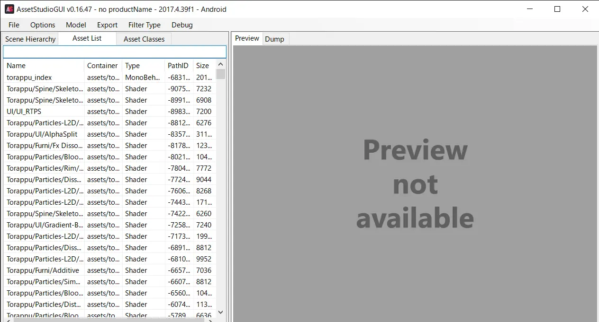
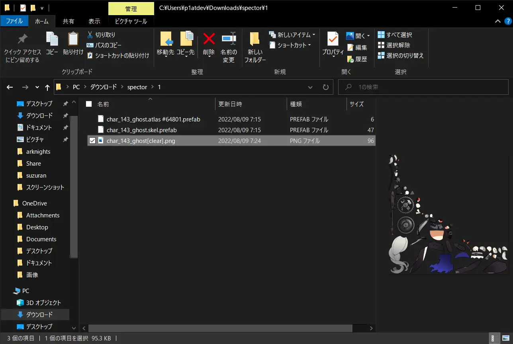
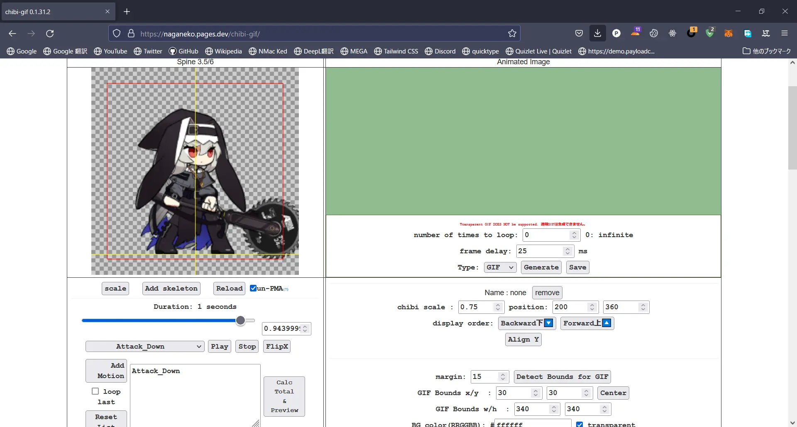
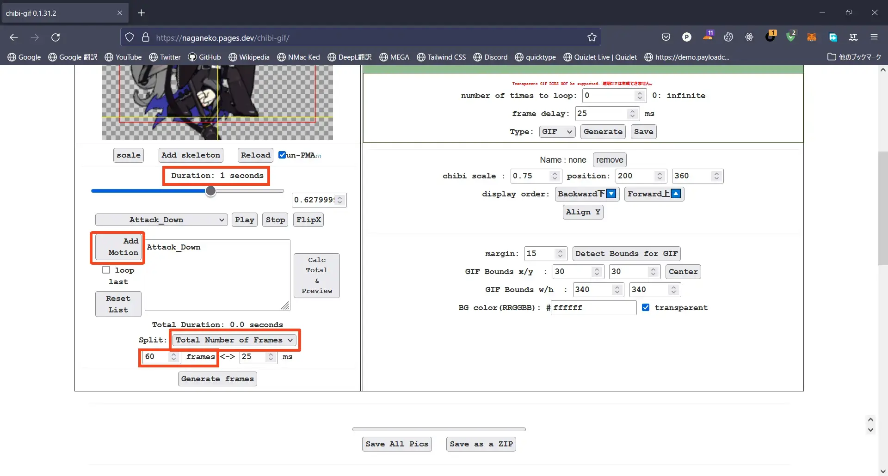

アークナイツの SD キャラのアニメーションって可愛いよね

たまに YouTube で見かけるような感じの、アニメーション GIF が欲しくなったので、それの作り方とか色々メモ

ほぼこの [Reddit スレッド](https://www.reddit.com/r/arknights/comments/f5i62f/the_guide_to_arknights_sprite_ripping_animation/) でやってることと同じ

だけどこの記事読んでる人にとっては多分日本語で説明された方が分かりやすいと思うので解説する

# 注意点

この記事では、ゲームデータの解析を行います。これを真似したことで発生した損害などについては責任を負いません。全て **自己責任** で行ってください。

# 準備

## 用意するもの

-   Windows 10 の PC (性能はある程度雑魚でも可)
-   インターネット環境
-   Adobe ライセンス

## 簡単な流れ

1. Android 版のアークナイツを用意
2. ファイルアプリからアークナイツの `.obb` ファイルを抜き出す
3. `.obb` ファイルを `.zip` として解凍
4. AssetStudio という解析ツールに、解凍して出てきた `asset` フォルダを読み込む
5. 目的の SD キャラのファイルを抽出
6. Photoshop などを利用して透過テクスチャを生成
7. chibi-gif を利用して GIF 生成

# Android 版のアークナイツを用意

Android 版のアークナイツが必要となります。理由としては、Unity ゲームの解析をする際、Android 版が一番やりやすいからです。おそらく iOS 版でもできるのでしょうが、アプリデータの抜き出しからもうめんどかったりと、良いことが一つもないので大人しく Android 版をダウンロードしてください。

Android のスマホを持っていない人は、エミュレータを使いましょう。
おすすめは、[MuMu Player](https://www.mumuglobal.com/jp/) です。広告が少ないしシンプルで良いです。(招待コードとかアフェリエイトじゃないよ)

アークナイツのダウンロードができたら、ちゃんと **起動してデータダウンロードをすべて終わらせてください**。チュートリアルを終わらせたりする必要はないです。
これをしないと、オペレーターのデータがダウンロードされないので、中を解析しても何もありません。


**ちゃんとダウンロードを終わらせて、この画面に辿りつきましょう**

# ファイルアプリからアークナイツの `.obb` ファイルを抜き出す

MuMu 純正のファイルマネージャを使いました。エミュレータやデバイスによっては多少見た目やファイル構造が異なるかもしれませんが、大体同じです。


目的のファイルは、`/Android/obb/com.YoStarJP.Arknights/main.xx.com.YoStarJP.Arknights.obb` です
`xx` の部分は二桁の数字で、多分バージョンによって変わったりします(未検証)


見つけたら、PC にこのファイルを持っていきます。専用の手段がある場合はそれに従ってください。MuMu の場合は、PC との共有フォルダがあるのでそこへコピペします。

MuMu では `/$MuMuSharedFolder` が共有フォルダです。


先ほど `.obb` を選択したのでここで貼り付け。


Windows 側では、`Documents` に `MuMuSharedFolder`があります。


中にちゃんと `.obb` があります。ここで作業するのはなんか気持ち悪いので、適当に他のフォルダへコピペしてから作業します。


ダウンロードフォルダに移しました。先ほどの `.obb` という拡張子を `.zip` に変更します。実態はただの zip なんですね。

これを解凍しましょう


低スペの PC だとめちゃんこ時間かかるので気長に殲滅作戦でも周回しながら待ちましょう

解凍すると、`asset` というフォルダが入っています


これは後で使います

# AssetStudio セットアップ

AssetStudio は、Unity ゲームのアセット(画像とかもろもろ) を解析、抽出するためのツールです

この優秀なソフトは、残念ながら Windows 上でしか動作しないので、どうにかして Windows 環境を作りましょう

仮想環境で試した際、私の環境 (VMWare Fusion) では、クラッシュしたりフリーズしたりと安定しなかったので、実機がおすすめです

## .NET 6.0 を用意

このソフトを動かすには .NET が必要なので、それをインストールします。(今回は 6.0)

ダウンロード: https://dotnet.microsoft.com/ja-jp/download/dotnet/6.0


何も考えたくない場合は、SDK と書いてあるところの、Windows、x64 のとこをクリックしてダウンロードしましょう。


実行するだけで他の余計なものは欲しくないという場合は、デスクトップランタイムをインストールしましょう

こちらだけでもちゃんと動くことを確認しています


それぞれリンクをクリックするとインストーラーが落ちてくるので、それをダブルクリックで起動して指示に従ってインストールします


## AssetStudio ダウンロード

GitHub で公開されています

ダウンロード: https://github.com/Perfare/AssetStudio/releases/tag/v0.16.47


先ほどインストールした .NET は 6.0 なので、`AssetStudio.net6.vx.x.x.zip` を選んでダウンロードしましょう

すると、zip が落ちてくるので解凍します


このアイコンがついてる `AssetStudioGUI.exe` を使います

# AssetStudio を使う

`AssetStudioGUI.exe` をダブルクリックで起動します


すると、おそらく Windows Defender くんに止められるので、詳細>実行 から無理やり実行します

起動するとこんな感じ


早速先ほど解凍して出てきた `asset` フォルダを読み込みましょう


すると、ウィンドウの下の方に緑色のローディングゲージが出現します。ロードは普通に時間かかるので周回して待ってましょう。


ロードが終わるとこんな感じになります。`level1` などの名前に見覚えがある人もいるかもしれません。

ここから、テクスチャ等を探すには、`Asset List` タブを選択して、



青くフォーカスされている検索欄に名前を入れて検索します

## SD キャラデータの名称

戦闘で使われるオペレーターの SD の場合は、`char_AAA_BBBB` という形で命名されています。

`AAA` は、3 桁または 4 桁の数字です。100 未満の数字でも先頭に 0 埋めされて 3 桁になります。(例: ケルシーは `003`)

`BBBB` は、オペレーターの名前ですが、多くは略称であったり、本名だったり、開発時のコードネームだったりします。(例: スカジは `skadi`、スズランは `lisa`、Touch は `amedic`)

基地での SD の場合は、`build_char_AAA_BBBB` になります。

敵の場合は、`enemy_AAA_BBBB` という形になります

`AAA` はオペレーター同様数字

`BBBB` は、敵の名前ですが、大抵は予想できないような略称が使われます。(例: クヒツムは `spsbr`)

## SD キャラデータで必要なファイル

-   `char_AAA_BBBB`: 色付きテクスチャ
-   `char_AAA_BBBB[alpha]`: 白黒テクスチャ
-   `char_AAA_BBBB.skel`: ボーン、骨
-   `char_AAA_BBBB.atlas`: アニメーション

## 目的のオペレーターを探す

今回は、**スペクター** の **戦闘 SD** を探します。基地 SD の場合は、`char` を `build` に置き換えて読んでください。

多くの場合は、番号や略称はわからないため、一覧から探したほうが早い場合があります。

その場合は、`char_` と検索し、`Name` をクリックすることで名前順にし、`char_` で始まる部分から探しましょう


スペクターは `ghost` という名前になっているようです。

前後のファイルをいくつかみてみるとわかると思いますが、SD キャラのテクスチャは 2 種類あります

一つは、前右左を向いている時、もう一つは後ろを向いている時のものです。あれは二つの SD でできていたんですね。くるって裏返るアニメーションがあったため、てっきり表裏があるかのように見えていました。とても自然に切り替わっているのが分かりますね。

なお、基地 SD の場合は一つだけなので、よくわからなかったら基地の方だけ探してみるとシンプルで良いかもしれません。

テクスチャは目視で同じ形のものに分けることができますが、`.skel` と `.atlas` ファイルは目視では識別できないため、前後ろのどちらの SD が欲しいかに関わらず、丸ごと全部抽出して後で判別します。


パーツがバラバラに分けられているテクスチャファイル、色付きを二つと白黒のが二つ、`.skel` と `.atlas` をそれぞれ二つ選択したら、


Export > Selected assets からエクスポートします

エクスポートすると、複数のフォルダが生成されてしまうので、新たにフォルダを作ってからそこに出力するのがおすすめです。


こんな感じのが出力されます。

TextAsset の中には、


`.atals` と `.skel` が入っていますが、なぜか後ろに `prefab` が謎に付け足されています。この `prefab` は邪魔なので後で消えてもらいます。

Texture2D の中は、


パーツごとに分けられたテクスチャが入っていますね

この画像のような形になっていれば OK です。

# Photoshop でテクスチャを透過

今エクスポートされたテクスチャは背景が黒いため、このまま使うことができません。(正確には、できるけども黒くなって汚い)

なので、Photoshop を使って透過テクスチャを作ります。このために白黒テクスチャも抽出しました。

もし、Photoshop を使えない場合は、類似するソフトで同じことをできれば大丈夫です。

## 作業

今回は戦闘 SD の前を向いている方のテクスチャを使います。ぐるぐる目が入っている方が前です。


Photoshop にドラッグ&ドロップして開きます。こうするとアートボードのサイズを指定しなくて済むので楽です。


これと同じシルエットをした、白黒のテクスチャも使います


追加したら、右上らへんの ×○ のボタンの ○ を押して確定

**白黒の方のレイヤー**が選択されている状態で、`Ctrl + A`(Mac なら`Command + A`) を押して**全選択**し、`Ctrl + C` で**コピー**します


白い点線が追加されます。

そしたら、**色のついてる方のレイヤー** を選び、


チャンネルタブに切り替えて、下の方にある + ボタンでチャンネルを追加します


この状態で、`Ctrl + V` でペーストします


先ほどの + ボタンの左側にある、点線の「」をクリックします


すると、白黒のやつの白い部分だけが選択されます。


この状態で、**色がついてる方のレイヤーを選択してから**、先ほどの + ボタンの左のマスクをクリックします。


するとこのように綺麗に透過できます

これを書き出しましょう


名前はわかりやすいものにすればいいです。

# GIF を生成する

## 読み込む

ここからが本番。

chibi-gif というツールを使ってアニメーションさせていきます

リンク: https://naganeko.pages.dev/chibi-gif/


この左側の `Add skelton` をクリックして、アニメーションに必要な、透過テクスチャ、`.skel`、`.atlas` の三つを選択します。

しかし、先ほどの作業で取得した `.skel` や　`.atlas` は、どれが前向きなのか見分けることができません。なので、総当たりで確認します。

別のフォルダを作り、適当に選んだ `.skel`、`.atlas`と、透過テクスチャを入れます



ついでに、後ろについてる `prefab` や `#` で始まる数字も消します


こんな感じになったら、ようやく読み込むことができます


ここで、運よく正しい `.atlas` と `.skel` を選ぶことができていれば、 SD キャラが出現します。しかし、間違った組み合わせだと、エラーが表示されるか何も起きません。SD が表示されるまで組み合わせを変えて何度も試しましょう。

正しく選べると、このように


表示されます。

## フレーム生成

`-----` となっているプルダウンを選択すると、アニメーションを選ぶことができます。


`Idle` というアニメーションを選んだ場合です。待機モーションですね。

GIF にしたいアニメーションを選択したら、`Add motion` ボタンをクリックしてモーションを追加します
今回は、`Attack_Down` という攻撃モーションを選びました。



次は、フレームを設定します。このアニメーションは 1 秒のアニメーションで、これを 60 fps で再生したいので、Split に `Total Number of Frames` を選んでから `frames` を 60 にします。 3 秒なら 180 になります。



これで、`Generate Frames` をクリックするとフレームごとの画像が生成されます。


ここで `Save as ZIP` をクリックすれば、この大量のフレームを zip で保存できます。`Save All Files` だと画像単体のままダウンロードしてしまい、ごちゃごちゃになるのでおすすめしません。

GIF にするには、右上の`frame delay` を左側の数値を合わせから、`Generate` をクリックします。


生成には時間がかかります。


生成されるとそこで再生されます。保存する場合は、`Save` をクリックします。

しかし、デフォルトの状態では、アニメーションをすると端が見切れてしまうので、いい感じに調整しましょう。


右下のところで、`chibi scale` や　`position` をいじってはみ出ないようにします。

また、`Detect Bounds for GIF` をクリックすることで、アニメーション時の最大枠を生成してくれるので便利です。

これをやったら、再び `Generate frames` をしてから `Generate` します。


ちゃんと位置が調整されたフレームが生成されました。

このまま `Generate` してもよいのですが、そうすると背景が透過されないため、`Save as ZIP` でフレームを保存し、外部ツールで GIF を生成するとよいです。

ダウンロードした ZIP を解凍すると、それぞれのフレームが `char_AAA_BBB_D_EE_FFF.png` という名前で入っています。
`D` はアニメーション名の頭文字、`EE` は `frame delay` の整数値、`FFF` は通し番号です。

GIF を生成するのは何を使っても良いのですが、ffmpeg の呪文があるので共有しておきます。

```bash
$ ffmpeg -r 60 -i char_143_ghost_A_16_%03d.png -filter_complex "fps=$fps,scale=400:-1:flags=lanczos,split[a],palettegen,[a]paletteuse" -q:v 1 output.gif
```

`char_143_ghost_A_16_%03d.png` というのは、`char_143_ghost_A_16_XXX.png` を 001 から順番に処理していく、という意味なので、`char_143_ghost_A_16` の部分はそれぞれ自分のものと置き換えてください。

出来上がったものがこちらです。


# 最後に

他にも作ったので見て

## 我らの光


## クヒツム


