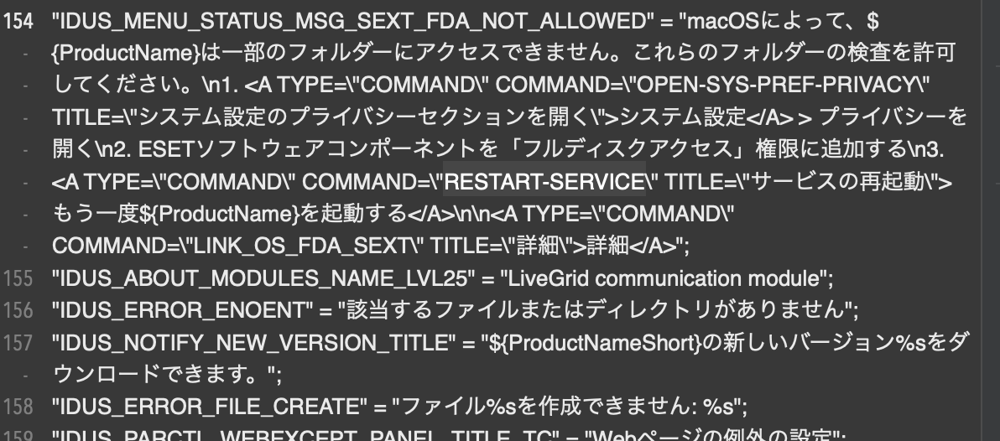

**この記事は旧 Blog から移行したものです** が、一部表現を校正しています

---

# 何をしたのか

ESET Endpoint Security for Mac(以下 EES)というセキュリティソフトの脆弱性を見つけました。
CVE-2021-37850 で登録されています。

[https://cve.mitre.org/cgi-bin/cvename.cgi?name=CVE-2021-37850](https://cve.mitre.org/cgi-bin/cvename.cgi?name=CVE-2021-37850)

## ESET の情報

「ESET（ESET, spol. s.r.o., イーセット企業体有限責任会社）は、コンピュータおよびインターネット用のセキュリティ関連製品の開発・販売を行うスロバキアのソフトウェア企業。」です。(Wikipedia より)
[https://ja.wikipedia.org/wiki/ESET](https://ja.wikipedia.org/wiki/ESET)

スロバキアの企業ですが、日本ではキヤノン株式会社を販売代理店としているため、多くの学校や企業でも採用されています。

ESET のソフトの種類も多く、android 用、家庭 PC(Mac/Windows)用、業務用、などとかなりの種類があります。
今回はその中でも **[ESET Endpoint Security for Mac](https://www.eset.com/jp/business/endpoint-security/mac-security/)** の脆弱性を発見しました。

## 脆弱性の内容

(バージョン v6.10.910.0 で動作を確認しました。)
この脆弱性には、複数の要因が関与しています。

1. `esets_gui`が**再**起動時に、既に起動されている`esets_gui`が存在していた場合、高い確率で全ての EES 関連のプロセスが終了する、また、その後再び起動できなくなる問題。
2. `xx.lproj/Localizable.strings`内の COMMAND を改変することで、ボタンが押された時の処理を一部変更することができる問題。
3. EES は通常`/Applications`直下に存在し、一般ユーザーは改変することができないが、他の適当なフォルダーにコピーすることでこれを回避し、様々なファイルを改変することができる問題。

これらを併用することで、EES を管理者権限を持たないユーザーでも強制的に終了させることができます。終了後は、一度出現する EES の確認アラートから以外 EES を再度起動させることはできないようになります。その状態では、全ての Web フィルタリング、ウイルス検出機能が停止します。

## EES 側の修正内容(v.6.11.1.0)

ESET 公式の説明
[https://support.eset.com/en/ca8151-denial-of-service-vulnerability-in-eset-products-for-macos-fixed](https://support.eset.com/en/ca8151-denial-of-service-vulnerability-in-eset-products-for-macos-fixed)

~~v6.11.1.0 のリリースでこの問題が修正される予定です。(2021/10/23 現在)~~
v6.11.1.0 以降のバージョンで修正されています (2021/10/7 リリースだったらしい)
このバージョンでは以下の方法でこの問題を回避しています。

1. `/Applications`以外から EES を起動できなくした。
2. EES アプリがなんらかの改変を受けている場合、それを察知して起動することがなくなった。
3. 異なるバージョンの EES の起動を拒否するようになった(以前からかもしれない)

私が確認することができたのは以上の 2 点です。
1 によって、ターミナルから esets_gui を起動したり、複製した EES を起動することができなくなりました。
2 の修正により、ローカライズファイルの書き換えや、一部処理の改竄を防いでいるようです。
3 では、新しいバージョンの EES がある環境で、古い EES を他から起動して停止させることを防いでいます。元からこういう仕様になっているのかもしれませんがわかりません。

# 発動の詳細方法

## PoC

この方法を手軽に実行できる PoC は以下にあります。
[https://github.com/p1atdev/CVE-2021-37850](https://github.com/p1atdev/CVE-2021-37850)

## 発動の動画

以下の動画は EES のライセンスが切れかけている状態だったので、そちらの文章を改竄しています。
https://www.youtube.com/watch?v=fOwKPzp4wBE

## EES の改竄と実行

対象バージョンの EES は、通常管理者権限がなければ編集ができない`/Applications`フォルダにありますが、これを他の編集可能なフォルダ`/tmp`などにコピペすると編集することができるようになってしまっています。
これは実は全てのアプリに共通する仕様なので、セキュリティが重要になるようなアプリを作っている方は要注意です。
編集可能になるということは、ローカライズファイルを改竄したり、画像を差し替えることができるようになってしまうということです。
また、見た目はほぼ同じだけれども、中身は全く異なる個人情報を抜き取るウイルスに差し替えることも理論上可能だと思います(多分)
なので、特にセキュリティソフトは改竄された状態のものや、通常インストールされた場所以外からの起動ができないようにする必要があったのです。
修正後のバージョンではきちんと修正されています。


_`ja.lproj/Localizable.strings`の一部。EES を再起動させるボタンが含まれた文章。_

この画像は EES のローカライズファイルの一部の写真です。パッと見てわかるように、HTML 記法が存在することがわかると思います。
<A>タグはボタンを表しており、EES 内でもさまざまなボタンを表すのに使われています。EES では`COMMAND`で指定されたコマンドを実行しているのがわかります。
この`COMMAND`の種類は結構あり、中でも`RESTART-SERVICE`はとても興味深いです。(画像に写っているやつ)
このコマンドが指定されているボタンを押すと、**管理者権限の要求や確認アラートも一切出ずに EES が再起動**します。
おそらく最も差し替えやすいテキストは、プレゼンテーションモードを有効にしたときに出てくる文章なので、そこを変更してあげるのが楽です。
(`PRESENTATION`で検索かけるとすぐヒットすると思います。)
もちろんこの作業だけでも数秒間 EES が停止しますが、それは数秒間だけです。
これを恒久化するためにはもう一つの欠陥を利用する必要があります。

## 原理

EES は一つ面白い特性を持っています。
それは、同時に二つ以上の EES プロセスが存在できないということです。
例えば、EES の GUI プロセスが起動しているときに、`esets_gui`(GUI アプリケーションを司るデーモン。`/Contents/MacOS/esets_gui`)を起動すると、以下のようなメッセージが出ます。


```bash
他のプロセスesets_guiがすでに実行されています
```

その後、**存在する二つの EES プロセスは両方停止**します。
この際、esets_daemon などの関連デーモンも同時に心中します。

勘のいい方ならもう気づいたかもしれません。
そうです。root 権限を持った EES を再起動させ、その間に先に自分の権限で他の EES を起動してやると、**後から起動してくる root 権限を持った EES は、選考で起動しているプロセスが存在するため停止します**。
一発で成功することはあまりありませんが、数回繰り返せばいつかはしっかりと起動しなくなります。

## 停止後

EES が停止後は、**自力で EES を再び起動させることはほぼ不可能**です。
以下の手段によってのみ EES を再開させることができます。

-   macOS の再起動

EES が停止した後、しばらくすると EES が自発的にデーモンが起動していないことを探知して再起動を促すアラートが出ます。
また、自分で MacOS を再起動させることでも EES を再開できます。

EES が停止している間は前述したように**全てのインターネットフィルタリングやウイルス検知機能が停止**します。

# 脆弱性の報告について

今回初めて脆弱性の報告という経験をしましたが、思っていたよりも時間がかかったな、というのが主な感想ですね。
最初にこの脆弱性を発見したのが 2021/08/31 で、ESET 社に報告したのは 2021/09/01、IPA に報告したのが 2021/09/05 で、最終的に脆弱性の審査が通って結果が送られたのは 2021/10/4 でした。
10/01 が起算日(?)だったらしく、ちょうど IPA が ESET 社と連絡を取れたらしいです。起算日がなんなのかはよくわからないですが、タイミングが悪いともっと待たされていたかもしれないです。

また、IPA から送られてくる資料の方式が面白かったです。基本的にパスワード付き zip ファイルで送られてくるのですが、そのパスワードが後からメールで送られてくる、いわゆる **PPAP と呼ばれるやつをまだ使っていた**んです。IPA は情報処理推進機構という情報系の、しかもセキュリティについても深く取り扱っているようなところなのに、こんな後進的なものを使っているのかと思うと少し残念ですね。(公式サイトも見やすいとは言えないし)

まあ、全体的に見ても面白い経験だったのでよかったです。

# 余談: 学校のフィルタリングについて

これは個人的な意見ですが、特に何か理由がなければ、学校は生徒に対して最低限のフィルタリング以外の制限をかけるべきではないと思います。
学校には青少年を有害情報から守る義務があるので、それの合わせた制限は理解できますし、異議はありません。
しかし、それを大きく超えた範囲でのアクセス制限や機能制限は、生徒への新しい技術への関心を失わせるだけでなく、せっかく配ることになった Macbook をただのアルミ盤にしているのです。Bluetooth の機能を制限すれば、AirDrop が使えなくなるのでファイル転送の利便性が損なわれ、学校に在籍する間にその機能の存在を知らないまま卒業することになるかもしれませんし、Stack Overflow を制限することで、プログラミングに興味を持った人へのやる気を失わせるかもしれません。とにかく、必要以上な制限は生徒にとって不利益しか産まないのです。
もし、それを狙って制限をしているとしても、これは教員にとっても不利益であると思います。
制限は強過ぎれば強すぎるほど、生徒に対してそれを破ろうとする気持ちを強くさせるだけに過ぎないのです。
これは一般的に**カリギュラ効果**として知られています。やるな、と言われたらやりたくなるのが人間の性なのです。
しかも、これに限っていえば、本来使えるべき機能をちゃんと使わせてあげるだけで、制限を突破しようとする人は出なかったはずなのです。
強い力を得るには大きな代償が伴うように、安定した管理者権限の奪取方法が見つかるまでに何人もの人が失敗されて初期化されて謎の説教を受けることになったのです。生徒だけでなく、教員にもこれは負担であることには違いないのです。
強すぎる制限は強い反抗心を生み、それに伴って双方に損害を与えるのです。

教員は、制限と管理の意味を取り違えているのではないのかと思います。
jamf でデバイスの保証コードを管理したり、自動で Zoom(最新ではない)を入れたり、VSCode(最新版)を入れられるようにできるのは管理であり、機械操作が苦手な生徒を救済することに繋がるので理解ができます。しかし、多くの有用なサイトを制限し、無料アプリですらダウンロードを許さないのは制限であり、得意な人のやる気を損なわせるものです。苦手な人にとっても不利益しないこの制限はなんの意味があるのでしょうか...

# 追記: この脆弱性についての感想

2022/8/17 での感想。
今この記事を読み直して、めちゃくちゃ読みにくくて痛いと思いました。書き直すのもめんどいので、記念としてそのまま残しておいて追記する形にします。

内容について簡単な要約。

macOS の多くのデスクトップアプリケーションは、`.app` ファイルを移動、コピペしても正常に起動できる。これは普通のアプリでは利点になるが、セキュリティソフトにとってはこの仕様は罠になる。

セキュリティソフトに限らずセキュアなことをするアプリケーションは、初期インストールされたパス以外での実行を許すと、外部の悪意あるアプリケーションによって偽造されたアプリケーションが実行される可能性があるということだ。大抵、信頼できないアプリは初期インストール時のパスへの書き込み権限を持たないことが多いので、コピペされたソフトの起動を禁止するだけで、この可能性を排除できる。

一応ちゃんとしたセキュリティソフトの会社の製品が、この点を考慮していなかったのは今考えても結構驚く。

また、同時に複数のプロセスの存在を許さないという仕様が、逆に首を絞めることになったのも面白い。

今回は、改ざんされた GUI アプリが実行できたこと、GUI 要素の改変によって通常はできない再起動操作ができてしまったことと合わさって大きな効果を発揮しました。

root 権限を持ったデーモンを、改ざんされた GUI アプリから再起動をかける。デーモンがいなくなった間に、自分権限でデーモンを先に起動しておく。後から復帰した root 権限を持ったデーモンは、先に起動してあるデーモンプロセスが存在するため、自身を kill する。その後、自分権限でデーモンを終了すると、デーモンはいなくなる。これが今回の脆弱性の概要です。

実行するアプリの改ざんチェックをしないことは、セキュリティソフトでは特に甚大な被害に繋がるイメージがありそうですが、一般のアプリケーションでも改ざんチェックをしないことによる被害はあります。わかりやすい例は割れ版アプリケーションですが、こちらは事前に存在して検証をしてくれるプロセスが存在しないため対策が難しく、これからも課題となりそうです。効果的な改ざん防止 or 改ざん検知の仕組みが求められていきそうですね。
